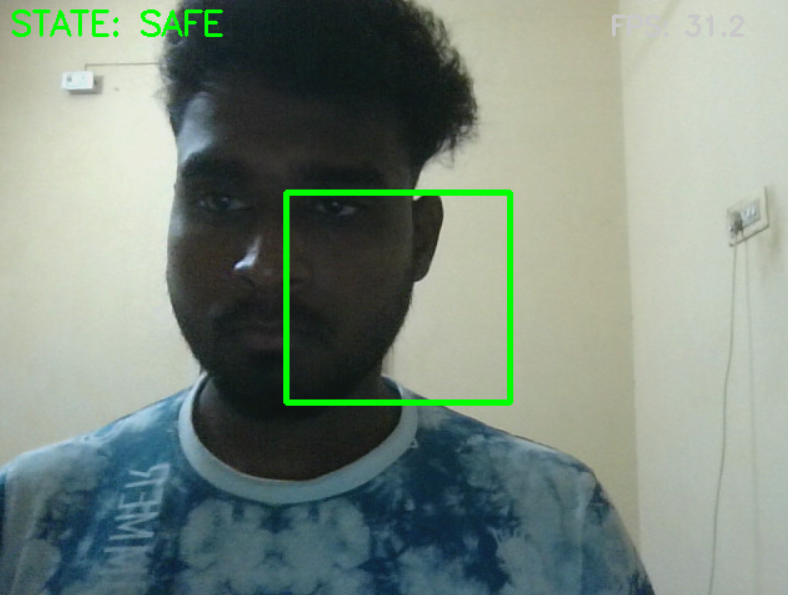
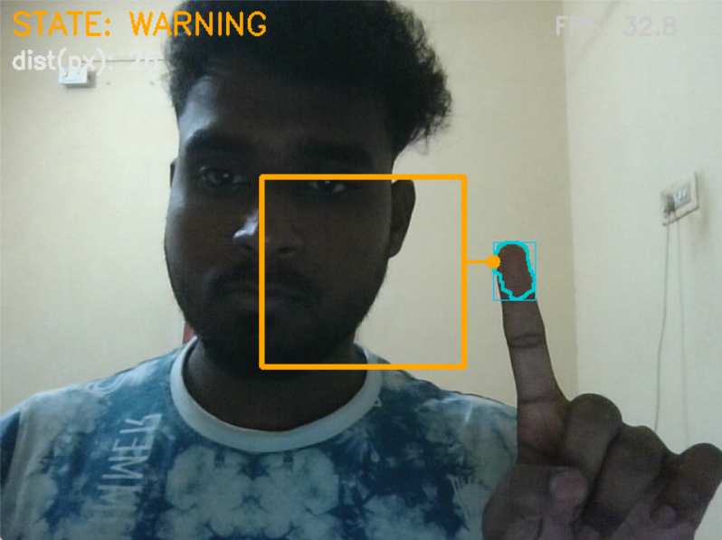
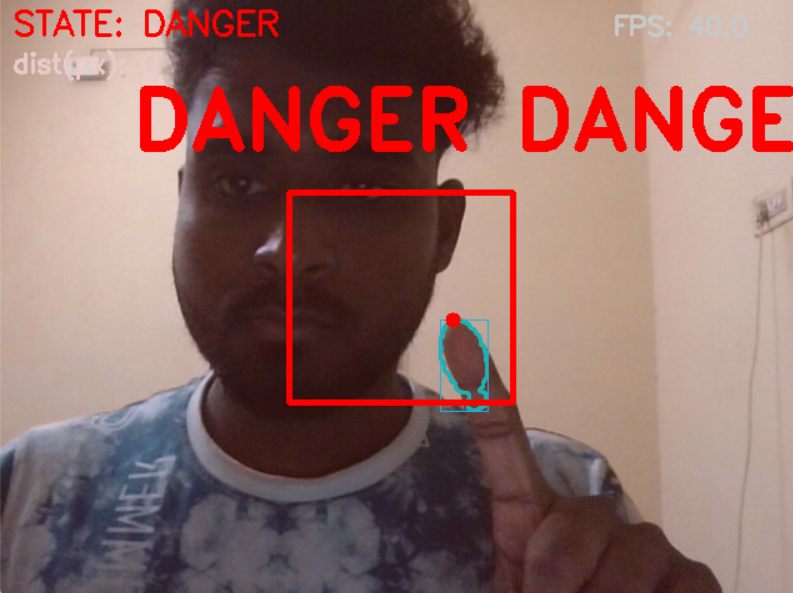

Hand-to-Virtual-Boundary Detection (POC)

This project is a real-time hand tracking prototype built using classical computer vision techniques (no MediaPipe, no OpenPose, no external pose APIs).
The system tracks the user’s hand from a live camera feed, measures its distance to a virtual boundary, and triggers visual warnings when the hand approaches or touches the boundary.

🚀 Project Objective : 

Build a Proof-of-Concept that demonstrates:

Real-time hand / fingertip tracking

No use of MediaPipe, OpenPose, or cloud APIs

Virtual object (rectangle) rendered on screen

Distance-based warning states:

SAFE – hand is far

WARNING – hand approaching

DANGER – hand touching/extremely close

Responsive on-screen feedback

Runs in real-time (8+ FPS) on CPU

Implemented using OpenCV + NumPy only

This POC uses skin color segmentation, contours, and distance geometry:

1. Skin Color Detection (YCrCb Color Space)

We convert the webcam frame into YCrCb color space and apply thresholds to isolate skin regions:

lower = np.array([0, 133, 77], dtype=np.uint8)
upper = np.array([255, 173, 127], dtype=np.uint8)
mask = cv2.inRange(ycrcb, lower, upper)

2. Mask Cleanup

To reduce noise:

Morphological opening

Morphological closing

Gaussian blur

3. Hand Detection via Contours

We extract contours and select the largest contour as the hand:

contours, _ = cv2.findContours(mask, cv2.RETR_EXTERNAL, cv2.CHAIN_APPROX_SIMPLE)

Visual Feedback

Rectangle border changes color

Closest distance point is shown

Flashing DANGER message

FPS display

SAFE : 

WARNING : 

DANGER : 

📈 Possible Improvements : 

Replace skin detection with:

Background subtraction

Motion-based segmentation

Convex hull fingertip detection

Add a calibration mode for dynamic skin thresholds

Add GUI sliders to tune thresholds in real-time

Use a tiny custom CNN (allowed) for better robustness

👤 Author

Logeshwaran A
Internship Assignment – Real-time Hand Tracking POC